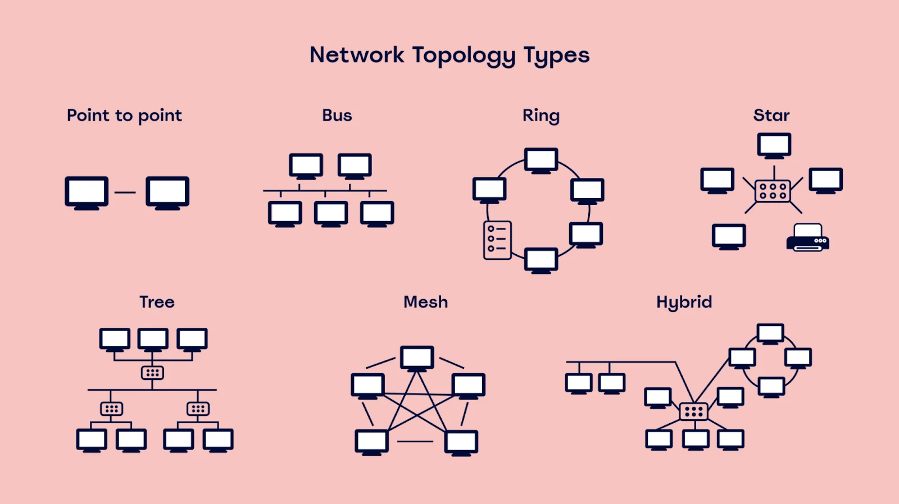
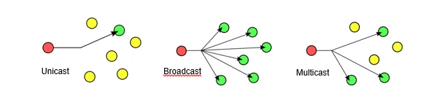
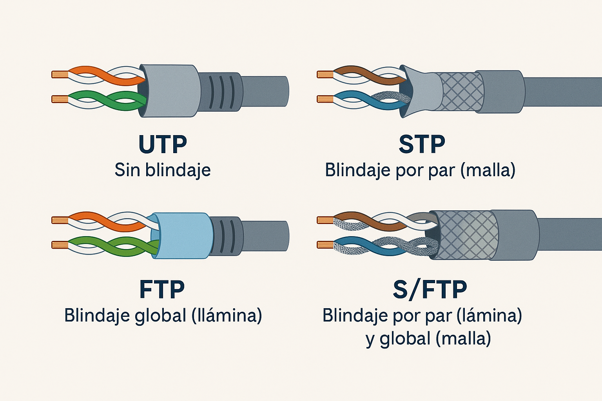
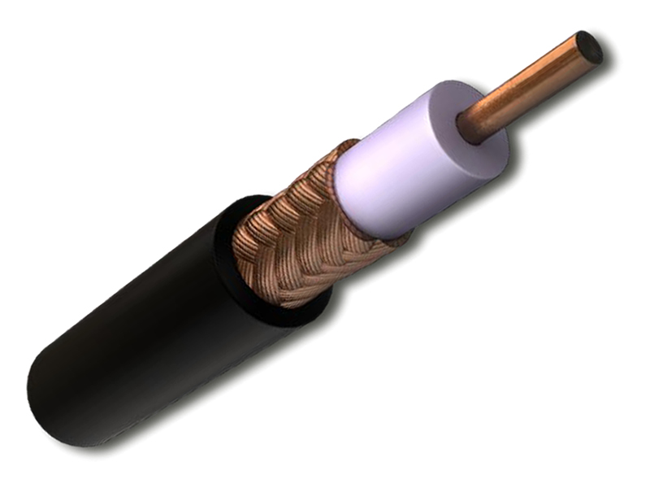
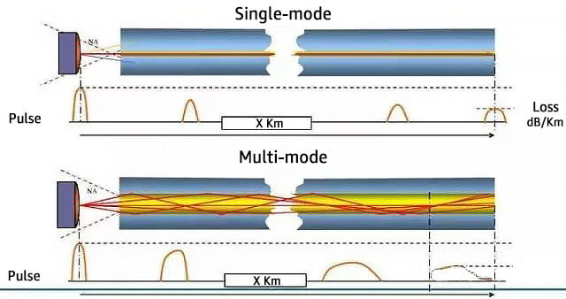
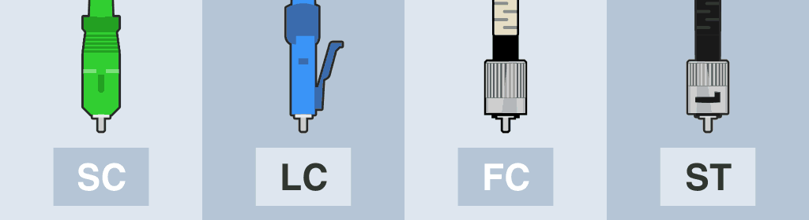
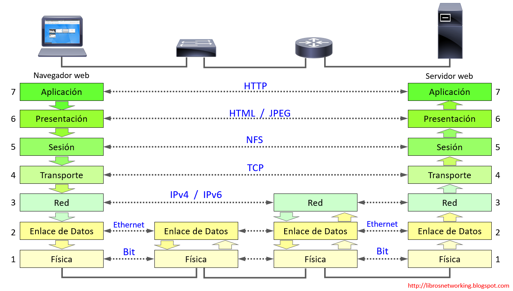
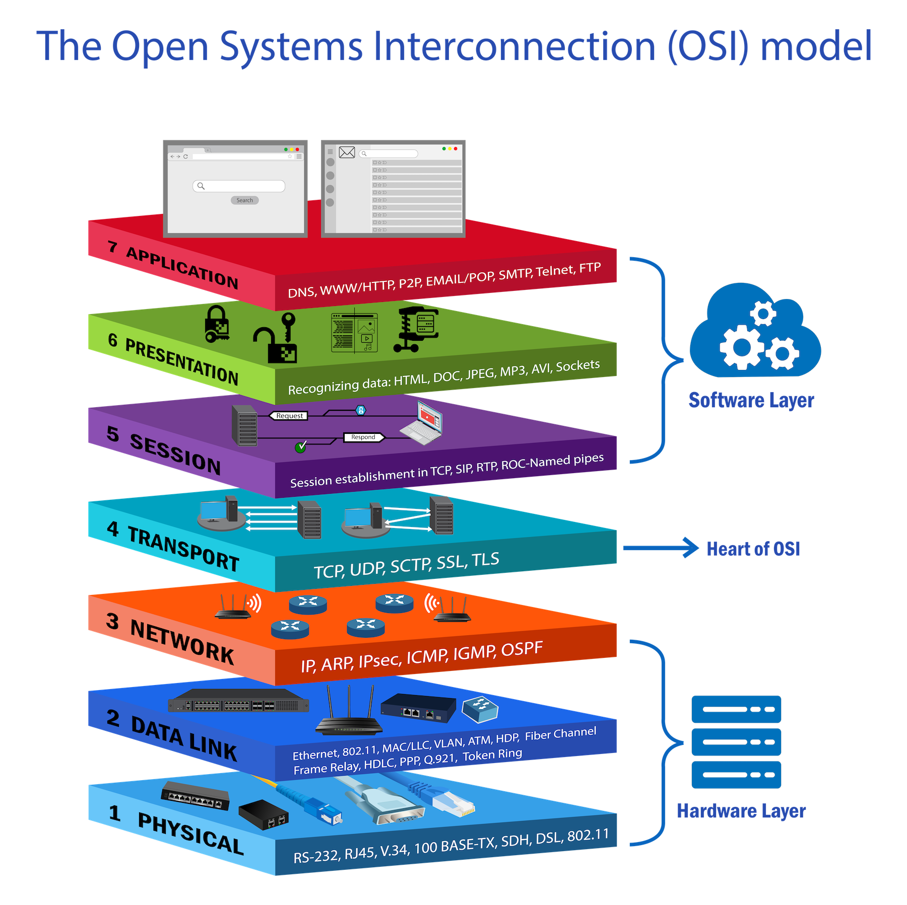
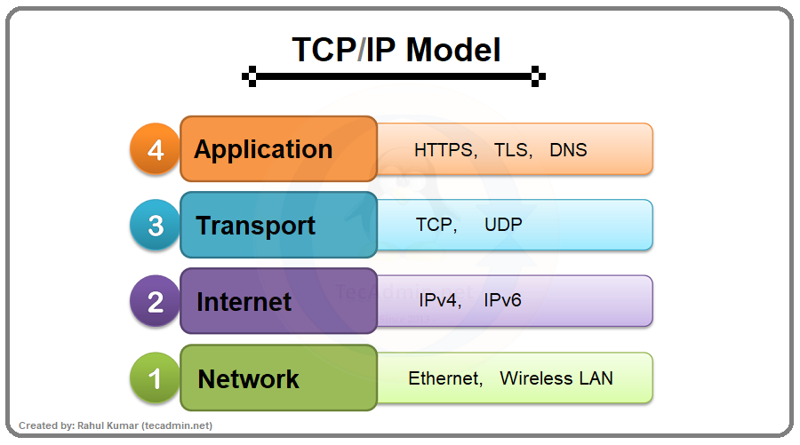
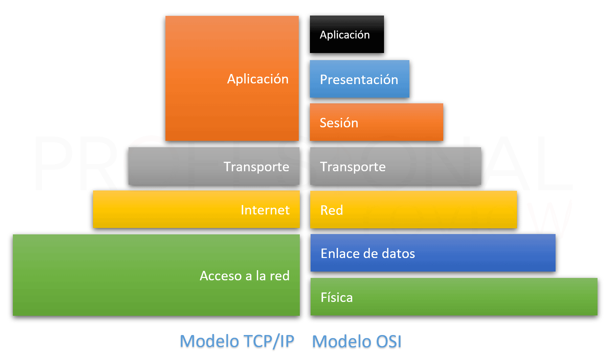

## Índice

1. [Introducción a las redes](#1-introducción-a-las-redes)
2. [Medios y hardware de red](#2-medios-y-hardware-de-red)
3. [Modelo OSI (7 capas)](#3-modelo-osi-7-capas)
4. [Modelo TCP/IP](#4-modelo-tcpip)
5. [Direccionamiento IPv4](#5-direccionamiento-ipv4)
6. [Cálculo de subredes (IPv4)](#6-cálculo-de-subredes-ipv4)
7. [Introducción a IPv6](#introducción-a-ipv6)
8. [Servicios esenciales](#servicios-esenciales)

## 1. Introducción a las redes

### ¿Qué es una red?
Una **red** es un conjunto de **dispositivos** (ordenadores, móviles, impresoras, cámaras, IoT…) **interconectados** que **intercambian datos** y **comparten recursos** (archivos, Internet, servicios). El objetivo es **comunicar** de forma **fiable, eficiente y segura**.

---

### Beneficios principales
- **Compartición de recursos:** Internet, impresoras, almacenamiento, apps.
- **Colaboración:** trabajo en equipo, mensajería, videoconferencia.
- **Centralización y control:** copias de seguridad, políticas, autenticación.
- **Escalabilidad y disponibilidad:** crecer sin reconfigurar desde cero.

---

### Conceptos clave y terminología
- **Nodo / Host:** dispositivo conectado a la red (PC, móvil, servidor…).
- **Enlace / Medio:** camino por el que viajan los datos (**cobre, fibra, radio**).
- **Interfaz de red (NIC):** hardware que conecta el dispositivo a la red (tiene **MAC**).
- **Dirección MAC:** identificador **físico** (capa de enlace).
- **Dirección IP:** identificador **lógico** (capa de red) para enrutar entre redes.
- **Encapsulación:** cada capa añade su **cabecera** (y a veces tráiler) a los datos.

---

### Métricas de rendimiento (y por qué importan)
- **Ancho de banda (capacidad):** tasa máxima teórica (p. ej., 1 Gb/s).
- **Throughput (rendimiento real):** tasa efectiva que se logra en práctica.
- **Latencia:** tiempo que tarda un mensaje en ir de origen a destino.
- **Pérdida de paquetes:** porcentaje de paquetes que no llegan.

> Regla mental: para **juegos/voz** prima **baja latencia/jitter**; para **copias** prima **throughput**.

---

### Clasificación por alcance
- **PAN** (Personal Area Network): muy corta distancia (Bluetooth, tethering).
- **LAN** (Local Area Network): red local de casa/centro educativo/oficina.
- **WLAN**: LAN inalámbrica (Wi-Fi).
- **CAN** (Campus): varias LAN dentro de un campus/edificio.
- **MAN** (Metropolitana): red de ciudad/área metropolitana.
- **WAN** (Wide Area Network): gran alcance (proveedores, Internet).

---

### Topologías (físicas/lógicas)
- **Estrella:** todos al **switch** central (la más común en LAN cableada).
- **Malla:** múltiples caminos redundantes (alta disponibilidad).
- **Árbol (jerárquica):** combinación escalable de estrellas.
- **Anillo / Bus:** históricas o nicho; aparecen en ciertos contextos industriales.

> **Física ≠ Lógica**: una red Wi-Fi puede verse lógicamente como estrella (AP central) aunque físicamente sea radio compartida.

  

---

### Modos de comunicación
- **Unicast:** uno-a-uno (la mayoría del tráfico).
- **Broadcast:** uno-a-todos dentro de la misma red (ARP, descubrimientos).
- **Multicast:** uno-a-muchos interesados (streaming, videoconferencia).

  

---

## 1) Unicast — *uno a uno*
**Qué es:** Comunicación entre **un emisor** y **un receptor** concretos.  
**Ejemplos:** Abrir una web (tu navegador ↔ servidor), enviar un correo SMTP, una petición a una API.

**Cómo funciona**
- **Capa 3 (IP):** el paquete va dirigido a **una IP destino**.
- **Capa 2 (Ethernet):** la trama lleva **una MAC destino** concreta.
- **Switch:** reenvía solo por el puerto donde está el receptor (si lo conoce).
- **Router:** encamina hacia la red del destinatario.

**Ventajas**
- Eficiente cuando solo **una** máquina necesita el dato.
- Fácil de **controlar y asegurar** (firewall, QoS por flujo).

**Limitaciones**
- Si **muchos** clientes piden **lo mismo**, el servidor repite N veces el envío (N flujos unicast).

---

## 2) Broadcast — *uno a todos* (en la misma red)
**Qué es:** Un emisor envía a **todas** las máquinas de su **red local** (dominio de broadcast).  
**Ejemplos típicos:**  
- **ARP**: “¿Quién tiene la IP X? respóndeme tu MAC”  
- Descubrimientos automáticos (algunos servicios locales)

**Cómo funciona**
- **IPv4:** dirección **255.255.255.255** (o broadcast de la subred).  
- **Ethernet:** MAC destino **ff:ff:ff:ff:ff:ff** (especial “todos”).  
- **Switch:** inunda **todos los puertos** de la VLAN (menos el de origen).  
- **Router:** **no** reenvía broadcast a otras redes (lo **bloquea** por defecto).

**Ventajas**
- Útil para **descubrir** quién está en la red cuando aún no sabes su MAC/IP.

**Riesgos / límites**
- Si hay **mucho broadcast**, **satura** la red (broadcast storm).
- No atraviesa routers: su alcance se limita a tu **subred/VLAN**.

> Nota: **DHCP** usa broadcast para descubrir el servidor, pero a menudo el router actúa como **relay** para “traspasar” la petición a otra red.

---

## 3) Multicast — *uno a muchos interesados*
**Qué es:** Un emisor envía **un solo flujo** y **varios receptores** que **se apuntan** a un “grupo” lo reciben. Es “uno a muchos”, **pero solo a quienes se suscriben**.

**Ejemplos típicos**
- Vídeo en directo/streaming corporativo a muchas aulas.
- Conferencias o distribución de datos en tiempo real.

**Cómo funciona (idea suave)**
- **IPv4:** direcciones **224.0.0.0–239.255.255.255** (rango multicast).
- **IPv6:** **ff00::/8**.
- Los receptores se **suscriben** al grupo (protocolo **IGMP** en IPv4 / **MLD** en IPv6).
- **Switches** con *IGMP snooping* aprenden **qué puertos** quieren ese grupo y **evitan inundar** toda la red.
- **Routers** pueden usar **PIM** para distribuir el tráfico entre redes si hace falta (detalle avanzado).

**Ventajas**
- Muy **eficiente** cuando **muchos** clientes necesitan **el mismo** contenido: el emisor solo manda **una vez**.

**Limitaciones**
- Requiere **soporte** de la red (IGMP/MLD, IGMP snooping, a veces configuración en routers).
- No todos los entornos/ISPs permiten multicast más allá de la red local sin configuración específica.

---

## Comparativa rápida

| Modo        | Destino            | Alcance por defecto        | Ejemplos                       | Pros                               | Contras                                  |
|-------------|--------------------|----------------------------|---------------------------------|-------------------------------------|-------------------------------------------|
| **Unicast** | 1 receptor         | Enrutado entre redes       | Navegar web, API, email         | Sencillo, controlable               | Poco eficiente si hay muchos receptores   |
| **Broadcast** | Todos en la subred | **Solo** la subred/VLAN    | ARP, descubrimiento local       | Descubrimiento rápido               | Puede saturar; no cruza routers           |
| **Multicast** | Varios suscritos   | Subred y (opcional) entre redes | Streaming, avisos simultáneos | Un envío para muchos (eficiente)    | Requiere soporte/configuración de red     |

---

### Componentes básicos de una LAN
- **Switch:** conmutación a nivel de enlace; crea dominios de colisión separados.
- **Router:** interconecta **redes distintas** y enruta tráfico IP.
- **Punto de acceso (AP):** conecta dispositivos **Wi-Fi** a la LAN.
- **Cableado/Medios:** UTP/FTP (cobre), **fibra óptica**, radio (Wi-Fi).

---

## Medios y hardware de red

En este apartado se estudian los **medios físicos** (por donde viajan los datos) y los **dispositivos** que forman la infraestructura básica de una red. La idea es reconocer **qué usar**, **dónde** y **por qué**.

---

### 2.1 Medios de transmisión

#### Cable de par trenzado (UTP/STP)
Es el cable **Ethernet** típico con conector **RJ-45**. Está formado por pares de hilos **trenzados** para reducir interferencias.

- **UTP (Unshielded Twisted Pair)**: sin malla metálica. Es el más común en oficinas y aulas.  
- **STP/FTP (Shielded/Foil Twisted Pair)**: con **apantallamiento** (malla o lámina). Se usa en entornos con más **ruido eléctrico** o tiradas largas junto a cables de potencia.

---

  

---

**Categorías (ejemplos habituales)**  
- **Cat5e**: hasta **1 Gb/s** (Gigabit) a **100 m**.  
- **Cat6**: **1 Gb/s** a 100 m y **10 Gb/s** hasta ~**55 m** en condiciones típicas.  
- **Cat6a**: **10 Gb/s** hasta **100 m** (mejor blindaje y separación).  
- *(Cat7/7a existen, suelen ser blindados y menos comunes en LAN estándar; en muchos casos Cat6a es suficiente.)*

**Aplicaciones**  
Conexión de **PCs, switches, routers, APs**, impresoras… en **redes internas (LAN)**.

**Ventajas**  
- Barato, flexible, fácil de crimpar e instalar.  
- Alimentación **PoE** posible (Power over Ethernet) para **APs**, cámaras, etc.

**Limitaciones**  
- Distancia típica **máxima 100 m** entre equipos de red.  
- Sensible a interferencias si el tendido es deficiente; en entornos ruidosos conviene **STP/FTP** y buena **puesta a tierra**.

---

#### Cable coaxial
Históricamente usado en redes locales (bus). Hoy se ve sobre todo en **operadores** (TV por cable / **DOCSIS**) y en **CCTV**.

- **Estructura**: conductor central, aislante, malla metálica (pantalla) y cubierta.  
- **Tipos** (según impedancia y uso): **75 Ω** (televisión/DOCSIS), **50 Ω** (radio, antenas).

---

  

---

**Ventajas**  
- Buena **inmunidad** al ruido, tiradas largas para señales específicas.

**Limitaciones**  
- Menos flexible para LAN modernas frente a UTP/fibra.  
- Conectores y equipos menos estándar en redes de usuario final.

---

#### Fibra óptica
Transmite **luz** en lugar de electricidad. Permite **altísimas velocidades** y **grandes distancias** con **inmunidad** a interferencias electromagnéticas.

- **Principio**: la luz se guía dentro de un núcleo por **reflexión interna**.
- **Tipos**:
  - **Monomodo (SMF, OS1/OS2)**: un solo “camino” de luz. Ideal para **largas distancias** (kilómetros a decenas de km).  
  - **Multimodo (MMF, OM1/OM2/OM3/OM4/OM5)**: varios “caminos”. Usado dentro de **edificios/campus**.

---

  

---

- **Conectores** habituales: **LC**, **SC**.  
- **Transceptores**: SFP/SFP+/SFP28/QSFP… (se insertan en switches/routers para elegir **velocidad** y **alcance**).

---

  

---

**Ventajas**  
- **Muy alta velocidad** (10G, 25G, 40G, 100G…).  
- **Gran distancia** (decenas de km en monomodo).  
- **Inmune** a interferencias, no conduce electricidad.

**Limitaciones**  
- Más **coste** y **delicadeza** en conectorización (requiere limpieza y radio de curvatura adecuado).  
- No transporta **PoE** (no corriente).

---

#### Medios inalámbricos
Comunican por **radio** (o luz en IR). Dan **movilidad** y ahorran cableado.

- **Wi-Fi (802.11 a/b/g/n/ac/ax)**:  
  - Bandas **2,4 GHz** (más alcance, más interferencias) y **5 GHz** (más velocidad, menos alcance); **6 GHz** (Wi-Fi 6E) en equipos modernos.  
  - Uso típico: redes domésticas y de oficina para portátiles y móviles.  
  - **Seguridad**: **WPA2/WPA3**; evitar WEP y WPA antiguos.
- **Bluetooth**: corta distancia, periféricos.  
- **IR (infrarrojo)**: línea de visión, hoy minoritario en datos.  
- **LTE/4G/5G**: acceso **móvil** a Internet; útil como **backup** de la conexión fija o para ubicaciones sin cable.

**Ventajas**  
- Movilidad, despliegue rápido, sin obras.

**Limitaciones**  
- **Interferencias**, **canales** saturados, **paredes** que atenúan.  
- **Seguridad**: proteger con buenas contraseñas, cifrado y segmentación.  
- Rendimiento **variable** (distancia, obstáculos, usuarios simultáneos).

---

### 2.2 Hardware y dispositivos de red

#### Tarjeta de red (NIC)
Interfaz que conecta el equipo a la red (**Ethernet** o **Wi-Fi**).  
- Velocidades comunes en Ethernet: **1 Gb/s**, **2.5 Gb/s**, **10 Gb/s**.  
- En Wi-Fi: depende del estándar y de las **antenas** del AP y del cliente.

#### Concentradores (Hub)
Equipo antiguo que **repite** todo lo que recibe a **todos** los puertos.  
- **No** diferencia destinatarios; provoca **colisiones** y comparte ancho de banda.  
- Hoy está **en desuso**; se prefiere **switch**.

#### Conmutadores (Switch)
Dispositivo **capa 2** que reenvía tramas según la **tabla MAC** (puerto ↔ MAC).  
- **Full-duplex**, sin colisiones, mejor **rendimiento** que un hub.  
- Puede ser:
  - **No gestionable**: enchufar y listo (SOHO, aulas pequeñas).  
  - **Gestionable**: soporta **VLAN**, **QoS**, **Spanning Tree**, **port mirroring**, **PoE**, etc.  
- **Beneficios**: más **eficiencia**, **segmentación** (VLAN), priorizar tráfico (QoS), alimentar equipos por **PoE**.

#### Enrutadores (Router)
Equipo **capa 3** que une **redes distintas** y decide la **ruta** de los paquetes.  
- En casa/pyme suele incorporar **NAT**, **DHCP**, **firewall**, **Wi-Fi**.  
- En empresa puede separar **subredes**, aplicar **políticas** y conectar a Internet con redundancia.

#### Puntos de acceso (Access Point, AP)
Conecta dispositivos **inalámbricos** a la red cableada.  
- Puede ser un **AP autónomo** o formar parte de una **red gestionada** por un **controlador** (mejor roaming y canales coordinados).  
- A menudo alimentados por **PoE** (un solo cable para datos + energía).

#### Puentes (Bridge) y repetidores
- **Bridge**: une dos segmentos **capa 2**, filtrando por **MAC** (conceptualmente, un switch básico).  
- **Repetidor**: **amplifica/extiende** la señal (capa 1). En Wi-Fi, los “extensores” pueden **repetir** la red, aunque el rendimiento puede bajar si no se planifica bien.

#### Firewalls (visión básica)
Equipo o función que **filtra tráfico** según reglas (IP, puertos, protocolos).  
- Pueden ser **dispositivos dedicados** o funciones del **router**.  
- Nivel inicial: pensar en “**permitir/bloquear**” conexiones entrantes/salientes; en entornos web, suelen proteger el **perímetro** y segmentar zonas (DMZ).

---

### Tabla explicativa de protocolos de red

| Protocolo | Capa TCP/IP | Explicación |
|----------|-------------|-------------|
| **TCP** (Transmission Control Protocol) | Transporte | Protocolo orientado a conexión que garantiza la entrega fiable y ordenada de los datos mediante control de errores, confirmaciones y control de flujo. Se utiliza cuando la integridad de la información es prioritaria. |
| **UDP** (User Datagram Protocol) | Transporte | Protocolo no orientado a conexión que envía datos sin verificar su recepción. Ofrece baja latencia y menor sobrecarga, siendo adecuado para aplicaciones en tiempo real. |
| **IP** (Internet Protocol) | Internet | Protocolo encargado del direccionamiento lógico y del enrutamiento de paquetes entre redes. No garantiza la entrega ni el orden de los paquetes. |
| **ICMP** (Internet Control Message Protocol) | Internet | Protocolo de control utilizado para enviar mensajes de error y diagnóstico relacionados con el funcionamiento de la red IP. |
| **ARP** (Address Resolution Protocol) | Acceso a la red | Protocolo que permite obtener la dirección MAC asociada a una dirección IP dentro de una red local. Es esencial para la comunicación en redes Ethernet. |
| **HTTP** (HyperText Transfer Protocol) | Aplicación | Protocolo que permite la transferencia de información en la web mediante un modelo cliente-servidor. No cifra la información transmitida. |
| **HTTPS** (HyperText Transfer Protocol Secure) | Aplicación | Versión segura de HTTP que utiliza cifrado TLS para garantizar la confidencialidad, integridad y autenticación de los datos transmitidos. |
| **FTP** (File Transfer Protocol) | Aplicación | Protocolo diseñado para la transferencia de archivos entre cliente y servidor, permitiendo la subida y descarga de ficheros. |
| **SMTP** (Simple Mail Transfer Protocol) | Aplicación | Protocolo utilizado para el envío de correo electrónico desde clientes a servidores y entre servidores de correo. |
| **POP3** (Post Office Protocol v3) | Aplicación | Protocolo de recepción de correo que descarga los mensajes del servidor al cliente, normalmente eliminándolos del servidor. |
| **IMAP** (Internet Message Access Protocol) | Aplicación | Protocolo de gestión de correo que permite acceder y administrar los mensajes directamente en el servidor sin descargarlos localmente. |
| **DNS** (Domain Name System) | Aplicación | Sistema de resolución de nombres que traduce nombres de dominio legibles por humanos en direcciones IP. |
| **DHCP** (Dynamic Host Configuration Protocol) | Aplicación | Protocolo que asigna automáticamente direcciones IP y otros parámetros de red a los dispositivos de una red. |
| **SSH** (Secure Shell) | Aplicación | Protocolo de administración remota que permite el acceso seguro a sistemas mediante cifrado de la comunicación. |
| **Telnet** | Aplicación | Protocolo de acceso remoto similar a SSH, pero sin cifrado, por lo que se considera inseguro y obsoleto. |
| **SNMP** (Simple Network Management Protocol) | Aplicación | Protocolo utilizado para la monitorización y gestión de dispositivos de red, como routers, switches y servidores. |

## 3. Modelo OSI (7 capas)

El modelo OSI (Open Systems Interconnection) es una referencia estándar que describe cómo se comunican los sistemas de red. Divide el proceso de comunicación en **siete capas**, cada una con funciones específicas, permitiendo la interoperabilidad y el diseño modular de las redes.

### 3.1. Propósito del modelo OSI

- Facilitar la comunicación entre equipos de diferentes fabricantes.
- Establecer una arquitectura por capas para el diseño y análisis de protocolos de red.
- Permitir el aislamiento de problemas: cada capa realiza funciones bien definidas.

### 3.2. Descripción de las 7 capas del modelo OSI

| Capa | Nombre              | Función principal                                                    | Ejemplos           |
|------|---------------------|---------------------------------------------------------------------|--------------------|
| 7    | Aplicación          | Interacción directa con el software del usuario                     | HTTP, FTP, SMTP    |
| 6    | Presentación        | Formato y traducción de datos (codificaciones, cifrado, compresión) | SSL, JPEG, GIF     |
| 5    | Sesión              | Establecimiento, gestión y finalización de sesiones                 | RPC, NetBIOS       |
| 4    | Transporte          | Segmentación, control de errores y flujo                            | TCP, UDP           |
| 3    | Red                 | Enrutamiento de datos entre redes                                   | IP, ICMP           |
| 2    | Enlace de datos     | Comunicación punto a punto, control de acceso al medio              | Ethernet, MAC      |
| 1    | Física              | Transmisión de bits por el medio físico                             | Cable, Wi-Fi       |

### 3.3. Flujo de información en el modelo OSI

- **Envío:** Los datos descienden capa a capa, agregando cabeceras específicas (encapsulación).
- **Recepción:** Los datos ascienden capa a capa, eliminando cabeceras (desencapsulación).

### 3.4. Importancia y utilidades para el desarrollo web

- Permite comprender dónde actúan los protocolos usados en Internet (HTTP en la capa de aplicación, TCP en la de transporte).
- Ayuda a localizar y resolver problemas de comunicación.
- Facilita el aprendizaje de redes y el diseño de soluciones seguras y eficientes.

### 3.5. Comparación con el modelo TCP/IP

- El modelo TCP/IP es más simple (4 capas), pero está basado en los mismos principios.
- El OSI es más detallado y útil en el ámbito académico y de análisis de redes.

> El modelo OSI proporciona una “hoja de ruta” esencial para entender el funcionamiento de las tecnologías de redes y el flujo de información desde el usuario hasta el medio físico.

---

  
  

---

## 4. Modelo TCP/IP

### 4.1 ¿Qué es el modelo TCP/IP?

El **modelo TCP/IP** es un modelo de referencia que define la arquitectura lógica utilizada para la comunicación entre sistemas interconectados en red. Establece cómo deben organizarse los protocolos y cómo deben interactuar entre sí para permitir el intercambio de datos de forma eficiente, fiable y escalable.

Este modelo fue desarrollado en el contexto de los proyectos de investigación de **DARPA** y constituye la base técnica sobre la que se construyó **Internet**. A diferencia de otros modelos conceptuales, como el modelo OSI, el modelo TCP/IP está directamente vinculado a protocolos reales y ampliamente implantados.

El modelo TCP/IP no describe implementaciones físicas concretas, sino que proporciona una **estructura funcional** que permite la interoperabilidad entre sistemas heterogéneos, independientemente del hardware, el sistema operativo o el fabricante.

---

  

---

### 4.2 Características principales del modelo TCP/IP

El modelo TCP/IP presenta una serie de características que explican su adopción universal:

- Está basado en **protocolos reales**, diseñados para su uso práctico en redes de gran escala.
- Es **independiente del hardware** y del sistema operativo, lo que facilita la interoperabilidad.
- Permite la **interconexión de redes heterogéneas**, incluso con tecnologías de enlace distintas.
- Utiliza un sistema de **direccionamiento lógico jerárquico** mediante direcciones IP.
- Está diseñado para ser **escalable**, tolerante a fallos y robusto ante pérdidas de conexión.
- Se adapta tanto a redes locales como a redes de alcance global, como Internet.

---

  

---

### 4.3 Capas del modelo TCP/IP

El modelo TCP/IP se estructura en **cuatro capas**, cada una de las cuales agrupa funciones relacionadas con un nivel concreto del proceso de comunicación. Cada capa ofrece servicios a la capa superior y utiliza los servicios de la capa inferior.

---

#### 4.3.1 Capa de Acceso a la Red

La **capa de acceso a la red** es la responsable de la transmisión de datos a través del medio físico y de la interacción directa con el hardware de red.

Esta capa integra funciones que, en otros modelos, se encuentran separadas en distintos niveles, como el acceso al medio, el direccionamiento físico y la transmisión de señales.

**Funciones principales:**
- Encapsular los paquetes IP en tramas.
- Gestionar el acceso al medio de transmisión.
- Controlar la entrega de datos dentro de la red local.
- Convertir los datos en señales eléctricas, ópticas o inalámbricas.

**Aspectos que abarca:**
- Direcciones físicas (MAC).
- Detección de errores a nivel de trama.
- Métodos de acceso al medio (CSMA/CD, CSMA/CA).

**Tecnologías y protocolos habituales:**
- Ethernet
- Wi-Fi
- ARP

---

#### 4.3.2 Capa de Internet

La **capa de Internet** se encarga de proporcionar un sistema de direccionamiento lógico y de hacer posible el envío de paquetes entre redes distintas. Su objetivo principal es que los paquetes alcancen su destino, aunque no garantiza la entrega ni el orden de los mismos.

Esta capa permite la comunicación entre redes interconectadas mediante el uso de routers y mecanismos de enrutamiento.

**Funciones principales:**
- Asignación y uso de direcciones IP.
- Enrutamiento de paquetes entre redes.
- Fragmentación y reensamblado de paquetes según el MTU del enlace.
- Gestión de errores y mensajes de control.

**Protocolos principales:**
- IP (IPv4 e IPv6)
- ICMP
- IPsec

---

#### 4.3.3 Capa de Transporte

La **capa de transporte** proporciona la comunicación lógica entre procesos que se ejecutan en sistemas finales. Es responsable de establecer la comunicación extremo a extremo entre aplicaciones.

Dependiendo del protocolo utilizado, esta capa puede ofrecer comunicación fiable o no fiable, orientada o no a conexión.

**Funciones principales:**
- Segmentación y reensamblado de datos.
- Control de errores mediante numeración y confirmación de segmentos.
- Control de flujo y congestión.
- Multiplexación y demultiplexación mediante puertos.

**Protocolos principales:**
- **TCP**: protocolo orientado a conexión, fiable y con control de errores y flujo.
- **UDP**: protocolo no orientado a conexión, sin control de errores, optimizado para baja latencia.

---

#### 4.3.4 Capa de Aplicación

La **capa de aplicación** agrupa los protocolos que permiten a las aplicaciones de usuario acceder a los servicios de red. Define las reglas de comunicación entre aplicaciones distribuidas.

Esta capa no corresponde a las aplicaciones en sí, sino a los **protocolos que utilizan** dichas aplicaciones para intercambiar información.

**Funciones principales:**
- Proporcionar servicios de red a las aplicaciones.
- Definir formatos de datos y métodos de intercambio.
- Gestionar sesiones, autenticación y control de acceso a nivel lógico.

**Protocolos habituales:**
- HTTP / HTTPS
- FTP
- SMTP
- POP3 / IMAP
- DNS
- DHCP
- SSH

---

### 4.4 Funcionamiento del modelo TCP/IP

El funcionamiento del modelo TCP/IP se basa en un proceso de **encapsulación y desencapsulación** de datos entre capas:

1. La aplicación genera los datos en la capa de aplicación.
2. La capa de transporte segmenta los datos y añade cabeceras de control.
3. La capa de Internet encapsula los segmentos en paquetes IP y determina la ruta.
4. La capa de acceso a la red encapsula los paquetes en tramas y los transmite.
5. En el equipo destino, el proceso se realiza a la inversa hasta entregar los datos a la aplicación correspondiente.

---

### 4.5 Relación entre el modelo TCP/IP y el modelo OSI

El modelo OSI define **siete capas**, mientras que el modelo TCP/IP agrupa esas funciones en **cuatro capas**, integrando varios niveles del OSI en una sola capa TCP/IP.

Esta simplificación hace que el modelo TCP/IP sea más práctico y esté mejor alineado con la implementación real de redes, mientras que el modelo OSI se utiliza principalmente como herramienta conceptual y didáctica.

---

### 4.6 Importancia del modelo TCP/IP

El modelo TCP/IP es esencial en el ámbito de las redes porque:

- Constituye la base técnica de Internet.
- Permite la interoperabilidad entre sistemas y redes heterogéneas.
- Facilita el diseño y la implementación de arquitecturas de red.
- Es clave para el análisis y la resolución de incidencias de red.
- Proporciona un marco común para el estudio de protocolos y servicios.

---

### 4.7 Resumen

- El modelo TCP/IP define la arquitectura de comunicación en redes.
- Se compone de cuatro capas funcionales.
- Cada capa cumple un papel específico en la transmisión de datos.
- Está basado en protocolos reales y ampliamente utilizados.
- Su comprensión es fundamental en estudios de Grado Superior en informática y redes.

---

falta direccionamiento

# Cálculo de subredes (IPv4)

## 6.1. De “cuántos hosts necesito” a la máscara

1. Pregunta inicial  
   - ¿Cuántos hosts necesito en esta red (equipos, routers, impresoras, etc.)?

2. Sumar 2 direcciones  
   - A los hosts que necesito les sumo 2, porque en cada red hay 2 direcciones que no se usan para equipos:
     - Dirección de red.
     - Dirección de broadcast.

3. Buscar una potencia de 2 adecuada  
   - Ejemplo: necesito 50 hosts.  
   - 50 + 2 = 52.  
   - Potencias de 2: 32, 64, 128, 256…  
   - Cojo la primera potencia de 2 que sea mayor o igual que 52 → 64.

4. Calcular bits de host y prefijo  
   - Como 64 = 2^6, se necesitan 6 bits para los hosts.  
   - Una IPv4 tiene 32 bits, así que:
     - Bits de host = 6  
     - Bits de red = 32 − 6 = 26  
     - Prefijo: /26.

5. Convertir el prefijo en máscara  
   - /24 → 255.255.255.0  
   - /25 → 255.255.255.128  
   - /26 → 255.255.255.192  
   - /27 → 255.255.255.224, etc.

Resumen para alumnos:

- Paso 1: hosts_necesarios + 2.  
- Paso 2: buscar potencia de 2 mayor o igual que ese resultado.  
- Paso 3: 2^(bits_host) = potencia elegida.  
- Paso 4: prefijo = 32 − bits_host.  
- Paso 5: pasar el prefijo a máscara decimal.

---

## 6.2. Cómo sacar red, hosts y broadcast

Suponemos que ya tenemos:

- Una dirección de partida: por ejemplo 192.168.10.0  
- Un prefijo: por ejemplo /26 → máscara 255.255.255.192

1. Calcular el tamaño del bloque  
   - Bloque = 256 − último octeto de la máscara.  
   - Para 255.255.255.192:  
     - 256 − 192 = 64.  
   - Significa que cada subred ocupa 64 direcciones en ese octeto.

2. Ver qué rango de direcciones cubre la subred  
   - Partimos de 192.168.10.0 y sumamos el tamaño de bloque:  
     - Primera red: de 192.168.10.0 a 192.168.10.63.  
   - Dentro de ese rango:  
     - Dirección de red: 192.168.10.0  
     - Broadcast: 192.168.10.63  
     - Hosts utilizables: de 192.168.10.1 a 192.168.10.62  

3. Número de hosts útiles  
   - Con /26 hay 6 bits de host → 2^6 = 64 direcciones totales.  
   - Hosts útiles: 64 − 2 = 62 (quitamos red y broadcast).

Tabla para este ejemplo:

| Dato                       | Valor              |
|---------------------------|--------------------|
| IP base                   | 192.168.10.0       |
| Prefijo                   | /26                |
| Máscara                   | 255.255.255.192    |
| Tamaño de bloque          | 64                 |
| Dirección de red          | 192.168.10.0       |
| Primer host               | 192.168.10.1       |
| Último host               | 192.168.10.62      |
| Dirección de broadcast    | 192.168.10.63      |
| Hosts útiles en la subred | 62                 |

---

## 6.3. Plantilla de pasos 

1. Apuntar los hosts que necesito.  
2. Calcular hosts + 2.  
3. Buscar la potencia de 2 más pequeña que sea mayor o igual que ese número.  
4. De esa potencia sacar:
   - Bits de host (por ejemplo, si la potencia es 64, entonces bits_host = 6).  
   - Prefijo = 32 − bits_host.  
   - Máscara en decimal.  
5. Calcular el tamaño de bloque: 256 − último octeto de la máscara.  
6. Con una IP base:
   - Dirección de red = primer número del bloque.  
   - Broadcast = red + bloque − 1.  
   - Primer host = red + 1.  
   - Último host = broadcast − 1.
